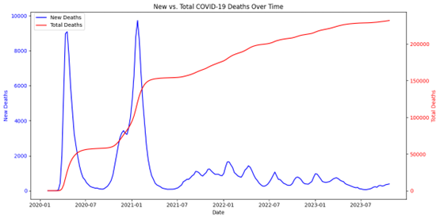
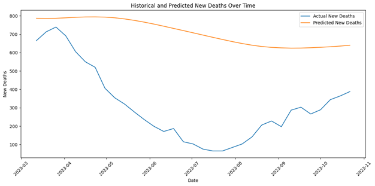

# Predicting COVID-19 UK Deaths

This repository contains the code and supporting materials for forecasting COVID-19 deaths in the UK using a deep learning approach with Long Short-Term Memory (LSTM) networks.   

## Overview
The COVID-19 pandemic has challenged healthcare systems worldwide, making accurate forecasting essential for effective resource allocation. Traditional models like ARIMA can struggle with the nonlinear and dynamic nature of pandemic data. This project uses LSTM networks to capture long-term dependencies in time-series data, providing forecasts of UK COVID-19 deaths and insights using explainable AI (XAI) techniques.

## Repository Structure
- **`.github/workflows`** - Contains a workflow used to download a copy of the original dataset to this repository.
- **`Figures`** - Contains some of the plots generated in the code.
- **`Code - 27.02.25.ipynb`** - Contains the Google Colab code notebook used for this project.
- **`README.md`** - Contains this readme file.
- **`owid-covid-data.csv`** - Contains the dataset used for this project, which was copied from the [Our World in Data (OWID) COVID-19 dataset](https://github.com/owid/covid-19-data/blob/master/public/data/owid-covid-data.csv) and contains various COVID-19 related statistics for multiple countries.

## Project Description

### Background & Motivation
The global impact of COVID-19 has emphasised the need for reliable forecasting models. By predicting COVID-19 deaths, governments and healthcare providers can better plan interventions and allocate resources. This project applies deep learning techniques to historical data from the Our World in Data (OWID) COVID-19 dataset, focusing on UK-specific trends.

### Dataset Overview
1. **Data Source:**
     - The dataset is obtained from the [Our World in Data (OWID) COVID-19 dataset](https://github.com/owid/covid-19-data/blob/master/public/data/owid-covid-data.csv), which provides global daily updates on COVID-19 cases, deaths, and other epidemiological variables. The dataset covers information from multiple countries and regions, enabling a comprehensive analysis of mortality trends. 
2. **Pre-processing & Exploratory Data Analysis (EDA):**
     - Filtered the OWID COVID-19 dataset to focus on UK data.
     - Filtered the dataset to focus on specific columns (i.e. `new_deaths`, `new_cases`, `population`, etc).
     - Removed any missing values.

### Methodology
1. **Data Pre-processing:**
     - Filtering dataset to include records from 2nd February 2020 onwards.
     - Defining the target variable (`new_deaths`) and normalising it with a MinMaxScaler function.
2. **Sequence Generation:**
     - Generated sequences using a sliding window approach (30 days per sequence) for time-series forecasting.
     - Split the dataset into 80% training data and 20% validation data.
3. **Model Architecture:**
     - Built an LSTM network with two layers (50 units each) followed by a Dense output layer.
     - Compiled the model with the Adam optimizer and mean squared error loss function.
4. **Training & Evaluation:**
     - Employed early stopping to avoid overfitting.
     - Trained the model for up to 50 epochs with a batch size of 32.
5. **Prediction & Visualisation:**
     - Transformed the predictions back to their original scale using the inverse of the MinMaxScaler function.
     - Plotted the historical and predicted `new_deaths` values over time.
 
 ### **Results:**
1. **Visualising Results:**
     - Plotted the historical and predicted `new_deaths` values over time.

2. **Performance Assessment:**
     - Plotted loss curves.
     - Calculated performance metrics such as MAE, MSE, RMSE, and $R^2$ score
     - Explainable AI - Used SHAP to create a waterfall plot and explain feature contributions.

### **Conclusion:**
- The LSTM model captured general trends in COVID-19 deaths but tended to overestimate new deaths during periods of lower mortality.
- Despite detecting overall patterns, performance metrics (e.g., a negative $R^2$ score) show that further refinements (e.g.enhanced preprocessing, refined architecture, and feature engineering) are necessary.

## Bibliography
- Box, G. E. P., Reinsel, G. C. & Jenkins, G. M., 2008. Time Series Analysis: Forecasting and Control. 4th ed. s.l.:Wiley.
- Chimmula, V. K. R. & Zhang, L., 2020. Time series forecasting of COVID-19 transmission in Canada using LSTM networks. Chaos, Solitons & Fractals, Volume 135.
- Shastri, S. et al., 2020. Time series forecasting of COVID-19 using deep learning models: India-USA comparative case study. Chaos, Solitons & Fractals, Volume 140.

## Author:
- [Riya Chandaria](https://github.com/riyachandaria)

